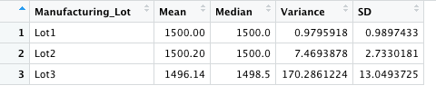

# MechaCar_Statistical_Analysis

## Linear Regression to Predict MPG

Using the linear regression statistical model, where the mpg is the dependent variable and the vehicle lenght, vehicle weight, spoiler angle, ground clearence, and AWD are the indepedent variable, we can observe that vehicle lenght and ground clearence (as well as intercept) are statitically unlikely to provide randon amount of variance to the linear model, meaning that vehicle lenght and ground clearance have a significant impact on mpg (miles per gallon). Since the intercept is statistically significant, there are other variables and factor that contribute to the variation in miles per gallon that have not been included in our model. 

According to our results, the p-value of our linear regression analysis is 5.35e-11, which is much smaller than our assumed significance level of 0.05%. We can state that there is suficient evidence to reject our null hypothesis, which means that the slope of our linear model is not zero.

Based on the summary output, we see that the r-squared value of the model, which determines if the model sufficiently predicts our dependent variable, is 0.71. which means that the model sufficiently predicts our dependent variable, mpg. 

*Fig.1 Linear Regression Summary Output*

## Summary Statistics on Suspension Coils

The design specifications for the MechaCar suspension coils dictate that the variance of the suspension coils must not exceed 100 pounds per square inch. Therefore, based on the Summary Statistics on Suspension Coils for all manufaring lots, Fig. 2, where the variance is 62.29 pounds per square inch, we can conclude that, overall, the manufacturing data meets this design specification for all manufacturing lot. 

*Fig.2 Summary Statistics for all manufacturing lots*

If we look at the results invidially, Fig.3, we can determine that lot 3 does not meet the design specifications since it has a variance of 170.29 pounds per square inch. Lot 1 & Lot 2 do meet the design specification based on the variances of 

Does the current manufacturing data meet this design specification for all manufacturing lots in total and each lot individually? Why or why not?

*Fig.3 Summary Statistics for each manufacturing lot*

 ## T-Tests on Suspension Coils
 
 then briefly summarize your interpretation and findings for the t-test results. Include screenshots of the t-test to support your summary.
 
 ## Study Design: MechaCar vs Competition
 
 Write a short description of a statistical study that can quantify how the MechaCar performs against the competition. In your study design, think critically about what metrics would be of interest to a consumer: for a few examples, cost, city or highway fuel efficiency, horse power, maintenance cost, or safety rating.
In your description, address the following questions:
What metric or metrics are you going to test?
What is the null hypothesis or alternative hypothesis?
What statistical test would you use to test the hypothesis? And why?
What data is needed to run the statistical test?

Use the statistical cheat sheet below to help you in your statistical design.

You will earn a perfect score for Deliverable 4 by completing all requirements below:

The statistical study design has the following:
A metric to be tested is mentioned (5 pt)
A null hypothesis or an alternative hypothesis is described (5 pt)
A statistical test is described to test the hypothesis (5 pt)
The data for the statistical test is described (5 pt)
