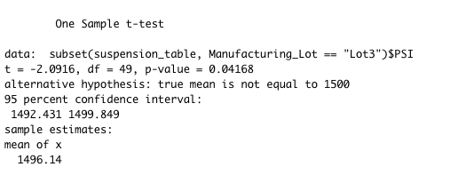

# MechaCar_Statistical_Analysis

## Linear Regression to Predict MPG

Using the linear regression statistical model, where the mpg is the dependent variable, and the vehicle length, vehicle weight, spoiler angle, ground clearance, and AWD are the independent variables, we can observe that vehicle length and ground clearance (as well as intercept) are statistically unlikely to provide a random amount of variance to the linear model, which means that vehicle length and ground clearance have a significant impact on mpg (miles per gallon). 

Since the intercept is statistically significant, some other variables and factors contribute to the variation in miles per gallon that have not been included in our model. 

According to our results, we can state that there is sufficient evidence to reject our null hypothesis, which means that the slope of our linear model is not zero since the p-value of our linear regression analysis is 5.35e-11, which is much smaller than our assumed significance level of 0.05%. 

Additionally, based on the summary output, we see that the r-squared value of the model, which determines if the model sufficiently predicts our dependent variable, is 0.71, which means that the model sufficiently predicts our dependent variable, mpg. 

*Fig.1 Linear Regression Summary Output*

## Summary Statistics on Suspension Coils

The design specifications for the MechaCar suspension coils dictate that the variance of the suspension coils must not exceed 100 pounds per square inch. Therefore, based on the Summary Statistics on Suspension Coils for all manufacturing lots, Fig. 2, where the variance is 62.29 pounds per square inch, we can conclude that, overall, the manufacturing data meet this design specification for all manufacturing lots.

*Fig.2 Summary Statistics for all manufacturing lots*

If we look at the results individually, Fig.3, we can determine that lot 3 does not meet the design specifications since it has a variance of 170.29 pounds per square inch. Lot 1 & Lot 2 meet the design specification based on their variances of 0.98 and 7.47, respectively. 

*Fig.3 Summary Statistics for each manufacturing lot*

 ## T-Tests on Suspension Coils
 
Performing t-tests to determine if all manufacturing lots and each lot individually are statistically different from the population mean of 1,500 pounds per square inch, we can observe that: 

- The p-value across all lots is 0.06, and assuming a significance level of 0.05 percent, our p-value is above our significance level. Therefore, we do not have sufficient evidence to reject the null hypothesis, and we would state that the two means are statistically similar.

*Fig.4 t-test across all lots*

- The p-value for Lot 1 is 1, and assuming a significance level of 0.05 percent, our p-value is above our significance level. Therefore, we do not have sufficient evidence to reject the null hypothesis, and we would state that the two means are statistically similar.

*Fig.5 t-test on Lot 1*

- The p-value for Lot 2 is 0.61, and assuming a significance level of 0.05 percent, our p-value is above our significance level. Therefore, we do not have sufficient evidence to reject the null hypothesis, and we would state that the two means are statistically similar.

*Fig.6 t-test on Lot 2*

- The p-value for Lot 3 is 0.042, and assuming a significance level of 0.05 percent, our p-value is lower than the significance level; therefore, we have sufficient evidence to reject the null hypothesis and state that the two means are statistically different.

*Fig.7 t-test on Lot 3*
 
 ## Study Design: MechaCar vs Competition
 
To determine how MechaCar performs against the competition and using the vehicle's cost as one of the metrics to analyze, we could define the following null and alternative hypothesis:

Null Hypothesis - H0: Mean MechaCar cost is lesser or equal than the mean cost of competitor. 
Alternative Hypothesis - HA: Mean MechaCar cost is greater than the mean cost of competitor. 

Since it's one continuous variable to analyze, and we would have two samples, MechaCar costs, and competitors' costs, we should do a Two-Sample t-Test to see if there is a statistical difference between the distribution means from the two. 

To run this test, we would need a dataset that contains a column for "vehile_cost", and another column for vehicle_brand: "MechaCar" & "Competitor", and perform the Two-Sample t-test with: 

t.test(data$vehicle_cost[vehicle_brand$vehicle_brand == 'MechaCar'], data$vehicle_cost[vehicle_brand$vehicle_brand == 'Competitor']
